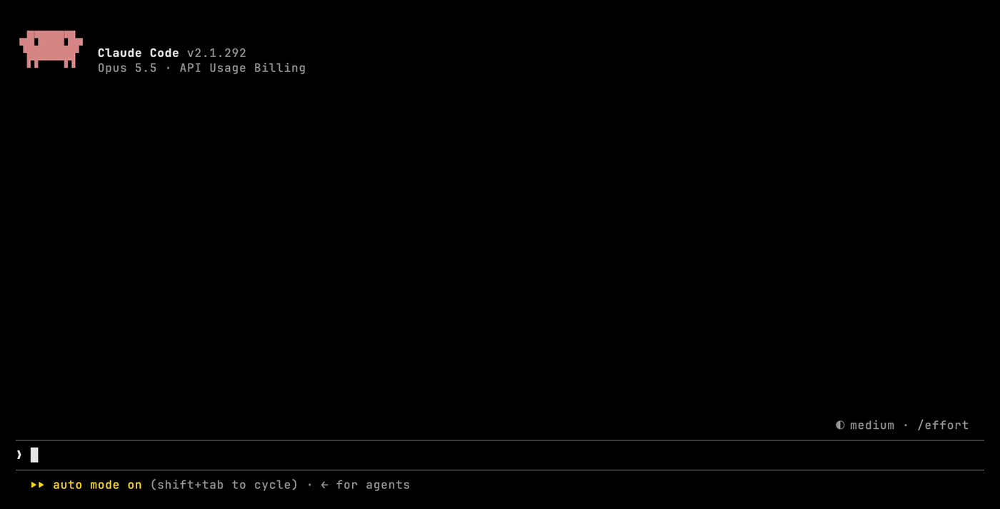

# prompt-drafts

[](https://github.com/vynnlee/mods/actions/workflows/check.yml)
[](https://code.claude.com/docs/en/plugins/mods/overview)
[](../LICENSE)

A [Claude Code mod](https://code.claude.com/docs/en/plugins/mods/overview) that keeps prompts aside as drafts and puts them back in the prompt box when you need them.

End a prompt with `;;` and press Enter. It is saved, not sent. Type `/drafts` and press a number to bring it back.



## Install

Requires Claude Code 2.1.287 or later. Mods are on by default.

```bash
claude plugin marketplace add vynnlee/mods
claude plugin install prompt-drafts@vynnlee
```

Or in a Claude Code session:

```
/plugin install prompt-drafts --marketplace vynnlee/mods
```

To try it for one session without installing:

```bash
git clone https://github.com/vynnlee/mods
claude --plugin-dir ./mods/prompt-drafts
```

## Usage

| To | Do |
|---|---|
| Save the prompt you are writing | End it with `;;` and press Enter. It is not sent. |
| Save some text | `/draft <text>` |
| Put a draft back in the prompt box | `/drafts`, then press its number. Or `/drafts <n>` |
| Save what is in the prompt box | **Save prompt box** in the sidebar |
| Delete a draft | `×` in the sidebar, or `/drafts rm <n>` |
| Bring back the draft you just deleted | **Undo** in the sidebar, or `/drafts undo` |

### What `/drafts` shows

- **110 columns or wider:** a sidebar with every draft and a numbered row above the prompt box. Press a number in the empty prompt box to use that draft, or `0` to close. You can also click a draft in the sidebar.
- **Narrower** (a phone, a split pane): Claude Code's own question dialog. Use the arrow keys or a number, then Enter. It lists four drafts at a time, and the last option shows the next page.
- **No prompt box** (headless runs): a plain numbered list.

### How drafts are kept

- Drafts belong to the session they were saved in. Other sessions do not see them, and resuming the session brings them back.
- Newest first, up to 50 per session. Saving the same text again moves it to the top.
- If the prompt box already holds other text when you put a draft in, that text is saved as a draft first.
- The sidebar shows the first three lines of each draft.
- Drafts of a session with no new draft for 30 days are removed.

## Settings

```
/plugin configure prompt-drafts@vynnlee
```

| Setting | Default | Values |
|---|---|---|
| `language` | `en` | `en`, `ko` (Korean) |

## Update

```bash
claude plugin update prompt-drafts@vynnlee
```

Third party marketplaces do not update on their own unless you turn on auto update in `/plugin` under Marketplaces.

## What it touches

`claude plugin validate .` reports every hook and call. In short:

| | |
|---|---|
| Hooks | `session.start`, `prompt.submit`, `command.run` (`draft`, `drafts`), `ui.close`, `ui.render` (`AbovePrompt`, `Pane`) |
| Prompt box | `$.prompt.read`, `$.prompt.fill` |
| Storage | `$.store.get`, `$.store.set`, `$.store.delete`, `$.store.keys` (the plugin's own store on your machine) |
| Session | `$.session.id` (which session a draft belongs to), `$.session.surface` |
| Interface | `$.command.register`, `$.ui.ask`, `$.ui.open`, `$.ui.close`, `$.ui.panes`, `$.ui.toast`, `$.ui.resolve`, `$.state.get`, `$.state.set`, `$.clock.now` |

- No network requests, no processes, no files outside the plugin store.
- Only prompts you type are checked for `;;`. Prompts submitted by other plugins or sessions pass through unchanged.

## Development

```bash
cd prompt-drafts
claude plugin validate . --strict
claude plugin test .
claude --plugin-dir .
```

The demo GIF is recorded with [VHS](https://github.com/charmbracelet/vhs) from `demo/prompt-drafts.tape`. `demo/run.sh` starts Claude Code in a throwaway config with only this mod loaded, so no login or model call is needed.

The pure logic (titles, previews, paging, messages) is in `hooks/drafts.ts` and tested in `hooks/drafts.test.ts`. The hooks are in `hooks/register.tsx`. Every release raises `version` in `.claude-plugin/plugin.json`, since installed copies only update when it changes. Changes are listed in [CHANGELOG.md](CHANGELOG.md).

## License

[MIT](../LICENSE)
